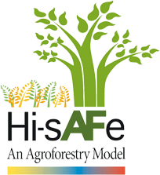

<!-- README.md is generated from README.Rmd. Please edit that file -->
Hi-sAFe 
==============================================================

Overview
--------

Hi-sAFe is a mechanistic, biophysical model designed to explore the interactions within agroforestry systems that mix trees with crops. The model couples the pre-existing STICS crop model to a new tree model that includes several plasticity mechanisms responsive to tree-tree and tree-crop competition. Trees and crops compete in 3D for light, water and nitrogen at a daily time step. The model is driven by daily meteorological data. Modeled system geometry can be custom built using a grid of square cells and flexible boundary conditions, permitting the simulation of isolated trees, tree lines, stand edges, and a wide range of agroforestry patterns. Parallel instances of the crop model on each cell simulate spatially explicit crop growth in relation to tree location. An opportunistic tree growth module accounts for the impact of resource availability on tree root architecture. Monoculture crop and tree systems can also be simulated, enabling calculation of the land equivalent ratio of agroforestry systems. Closure of the light, water and nitrogen budgets ensures energy and mass conservation in the system. Hi-sAFe is a novel tool for elucidating daily interactions for light, water, and nitrogen in agroforestry systems. Its 3D and spatially explicit form is key for accurately representing many competition and facilitation processes. Hi-sAFe can be used to explore:

-   agroforestry designs (e.g. tree spacing, crop type, tree row orientation)
-   management strategies (e.g. thinning, branch pruning, root pruning, fertilization, irrigation)
-   responses to environmental variation (e.g. climate change, soil depth, soil structure and fertility, fluctuating water table, latitude)

If you are new to Hi-sAFe, the best way to start is with the two foundational publications on Hi-sAFe:

-   Dupraz C, Wolz KJ, Lecomte I, et al. (2019) Integrating dynamic tree-crop interactions with the 3D Hi-sAFe agroforestry model: I. Theory and description.

-   Wolz KJ, Dupraz C, Lecomte I, et al. (2019) Integrating dynamic tree-crop interactions with the 3D Hi-sAFe agroforestry model: II. Calibration and validation for hybrid walnut

Installation
------------

### Hi-sAFe

You can install the lastest Hi-sAFe release from the [Hi-sAFe website](https://www1.montpellier.inra.fr/wp-inra/hi-safe/en/). The model runs on PC, Mac, and Linux platforms and requires Java Runtime Environment version 1.8 or later.

### hisafer

A suite of tools for building, running, and analyzing Hi-sAFe simulations is also available via the hisafer R package. *The use of hisafer is strongly recommended for all Hi-sAFe applications.* that The package includes a vignette to introduce users to the available functions. The hisafer source code is hosted online in [GitHub](https://github.com/kevinwolz/hisafer) and includes an [issue tracker](https://github.com/kevinwolz/hisafer/issues) where users can report bugs or suggest changes. To install hisafer from within R, you can run:

``` r
# install.packages("devtools")
devtools::install_github("kevinwolz/hisafer")
```

Usage
-----

Hi-sAFe is avaialable for public use free of charge. Any use Hi-sAFe should always cite the two foundational papers shown above.

Documentation
-------------

Complete documentation is available in the /doc folder.

Development
-----------

To incorporate updates into the Hi-sAFe source code, please submit a pull request for approval by a Hi-sAFe administrator.

Getting help
------------

If you encounter a clear bug, please file a minimal reproducible example on [GitHub](https://github.com/hisafe/hisafe/issues). You can post questions and other discussion topics here as well.
